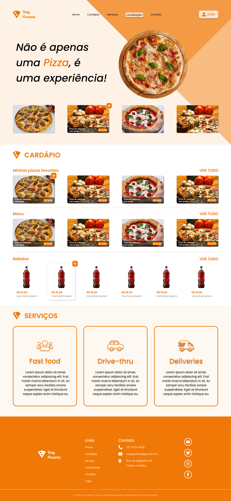

# Tony Pizzaria

Landing page criada com base no layout Figma do projeto Tony Pizzaria. O foco foi oferecer uma interface amigável, com destaque para os produtos principais, chamadas para ação (CTAs) e responsividade. Projeto desenvolvido com HTML e CSS.

[Figma](https://www.figma.com/design/CT1kG4O6Uig5MXcCX7YvVk/Pizza?node-id=0-1&p=f&t=gkdVWEyXw8rN1bSt-0)

# Screenshot

DesKtop-1440

Tablet-768

Phone-320

[Aline Alves de Souza](www.linkedin.com/in/aline-alves-engenheira)
